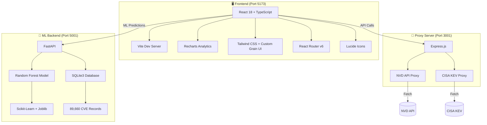

<div align="center">

# 🛡️ PatchPilot AI

### _AI-Powered Vulnerability Patch Prioritizer for Lean IT & SOC Teams_

> **"Know what to patch first — based on real-world risk, not just CVSS scores."**

[](https://react.dev)
[](https://www.typescriptlang.org)
[](https://vitejs.dev)
[](https://python.org)
[](https://fastapi.tiangolo.com)
[](https://scikit-learn.org)
[](LICENSE)

<br/>


---

**PatchPilot AI** transforms vulnerability management from _"patch everything by CVSS"_ into _"patch what attackers actually exploit first."_

</div>

---

## 📌 The Problem

Small IT and SOC teams face **hundreds of CVE vulnerabilities every month** but have limited time and engineering resources to patch everything immediately.

Standard vulnerability management relies almost exclusively on **CVSS scores**. However, CVSS measures _theoretical technical severity_ — it does **not** tell an IT team which vulnerability requires immediate fire-drill action versus routine monthly maintenance.

<div align="center">

| Traditional Approach | PatchPilot AI Approach |
|:---:|:---:|
| 🔢 CVSS score only | 🧠 Multi-factor AI risk scoring |
| 😰 Patch everything at once | 🎯 Prioritize what's actively exploited |
| 📊 Theoretical severity | 🌍 Real-world threat context |
| ❌ No exploit intelligence | ✅ CISA KEV + exploit availability |

</div>

---

## 🚀 Our Solution

**PatchPilot AI** replaces CVSS-only decision-making with an **explainable multi-factor Risk Scoring Engine** (0–100 score) that combines:

```
┌─────────────────────────────────────────────────────────────────┐
│                   PatchPilot AI Risk Engine                      │
├─────────────────────────────────────────────────────────────────┤
│                                                                 │
│   ██████████████░░░░░░░░░░░░░░░░  NVD & CVSS Severity    30%   │
│   ███████████████████░░░░░░░░░░░  CISA KEV Catalog       35%   │
│   ████████░░░░░░░░░░░░░░░░░░░░░  Internet Exposure      15%   │
│   ████████░░░░░░░░░░░░░░░░░░░░░  Asset Criticality      15%   │
│   ███░░░░░░░░░░░░░░░░░░░░░░░░░  Exploit Availability    5%   │
│                                                                 │
└─────────────────────────────────────────────────────────────────┘
```

---

## ⚡ Quick Start Guide

### Prerequisites

| Requirement | Version | Purpose |
|:---|:---|:---|
| **Node.js** | `v18.x+` | Frontend & Express proxy |
| **npm** | `v9.x+` | Package management |
| **Python** | `3.10+` | ML microservice & FastAPI |

### 🔧 Installation & Launch

```bash
# 1️⃣  Clone the repository
git clone https://github.com/HemanthKumar116/PatchPilotAI.git
cd PatchPilotAI

# 2️⃣  Install Node.js dependencies
npm install

# 3️⃣  (Optional) Configure NVD API Key for faster lookups
#     Without a key: ~5 requests/30s rate limit
echo "NVD_API_KEY=your_nvd_api_key_here" > .env
echo "PORT=3001" >> .env

# 4️⃣  Launch everything (Frontend + Express Proxy + Python ML Backend)
npm run dev
```

### 🌐 Access Points

| Service | URL | Description |
|:---|:---|:---|
| 🖥️ **Frontend Dashboard** | [`http://localhost:5173`](http://localhost:5173) | React UI with live charts & KPIs |
| 🔌 **Express Proxy** | [`http://localhost:3001/api/status`](http://localhost:3001/api/status) | NVD/KEV API proxy server |
| 🤖 **ML Microservice** | [`http://localhost:5001`](http://localhost:5001) | Python FastAPI + Random Forest |

---

## 🧮 Risk Scoring Formula

<div align="center">

### Explainable 0–100 Scale

</div>

```python
riskScore = (
    cvssSubscore        * 0.30 +   # NVD CVSS Base Score
    kevSubscore         * 0.35 +   # CISA Known Exploited Vulnerabilities
    exposureSubscore    * 0.15 +   # Internet Exposure Context
    criticalitySubscore * 0.15 +   # Asset Criticality Level
    exploitSubscore     * 0.05     # Exploit Code Availability
)
```

<details>
<summary><b>📐 Sub-score Calculation Details (click to expand)</b></summary>

<br/>

| Factor | Weight | Calculation | Example |
|:---|:---:|:---|:---|
| **CVSS Subscore** | 30% | `CVSS × 10` | CVSS 7.5 → `75 pts` |
| **CISA KEV Subscore** | 35% | Listed → `100`, Not listed → `0` | In KEV → `100 pts` |
| **Internet Exposure** | 15% | Internet-facing → `100`, Internal → `30` | External → `100 pts` |
| **Asset Criticality** | 15% | Critical `100` / High `75` / Medium `50` / Low `25` | Critical server → `100 pts` |
| **Exploit Availability** | 5% | Available → `100`, Unknown → `0` | PoC exists → `100 pts` |

</details>

### 🚦 Patch Priority Bands

| Band | Score Range | Action Required | SLA |
|:---:|:---:|:---|:---:|
| 🔴 **CRITICAL** | `90 – 100` | ⚠️ Patch Now — Active exploitation | **24 hours** |
| 🟠 **HIGH** | `75 – 89` | 🔧 Schedule urgent patching | **7 days** |
| 🟡 **MEDIUM** | `50 – 74` | 📋 Include in patch cycle | **30 days** |
| 🟢 **LOW** | `0 – 49` | 👁️ Monitor and track | **As needed** |

---

## 💡 The Key Insight: _"Lower CVSS ≠ Lower Priority"_

PatchPilot AI explicitly demonstrates **why CVSS alone fails IT teams**:

<div align="center">

| | **Vulnerability A** | **Vulnerability B** |
|:---|:---:|:---:|
| **CVE** | `CVE-2024-8891` | `CVE-2024-3094` (XZ Utils) |
| **CVSS Score** | **9.8** (Critical) | **7.5** (High) |
| **CISA KEV** | ❌ No | 🔥 **YES** |
| **Internet Exposed** | ✅ Yes | ✅ Yes |
| **Asset Criticality** | Critical | Critical |
| **Exploit Available** | ❌ No | ✅ Yes |
| | | |
| **🧠 AI Risk Score** | **59** 🟡 MEDIUM | **93** 🔴 CRITICAL |
| **Action** | Patch this month | ⚠️ **Patch immediately!** |

</div>

> **Result:** Vulnerability B scores **34 points higher** than A despite having a _lower_ CVSS score, because B is **actively exploited in the wild** and listed in CISA's KEV catalog!

---

## 📊 Application Features & Pages

<details>
<summary><b>🏠 Dashboard</b></summary>

- 5 SOC KPI metric cards with real-time vulnerability counts
- Prominent **"WHAT SHOULD I PATCH TODAY?"** hero card with top critical CVE
- Section 7 proof callout demonstrating CVSS vs AI Risk Score divergence
- 4 embedded **Recharts** visual analytics (Risk Scatter, Priority Distribution, KEV Pie, Risk Histogram)
</details>

<details>
<summary><b>🔍 Vulnerabilities</b></summary>

- Searchable, filterable, and sortable vulnerability table
- Filter by: Priority band, CVSS severity, KEV status, internet exposure, asset criticality
- Click any row to open the interactive detail modal
</details>

<details>
<summary><b>📋 Vulnerability Detail Modal</b></summary>

- Interactive progress-bar score contribution breakdown for each risk factor
- CISA KEV remediation due dates and vendor fix references
- Live environment context editor (change exposure, criticality, exploit status)
- Real-time score recalculation on context changes
</details>

<details>
<summary><b>🩹 Patch Queue</b></summary>

- Urgency-grouped remediation roadmap with 4 tiers:
  - 🔴 Patch Now | 🟠 Within 7 Days | 🟡 Within 30 Days | 🟢 Monitor
- Plain-English prioritization justifications for each CVE
</details>

<details>
<summary><b>📡 Intelligence</b></summary>

- NVD & CISA KEV live connection status indicators
- **"Refresh Threat Intelligence"** one-click sync trigger
- Manual live NVD CVE lookup tool with instant risk scoring
</details>

<details>
<summary><b>📥 CSV Import</b></summary>

- Upload custom vulnerability datasets (CSV format)
- Automatic field validation and risk score recalculation
- 1-click demo dataset reset for presentations
</details>

<details>
<summary><b>ℹ️ About</b></summary>

- Problem context and motivation
- CVSS limitations explained
- Solution architecture overview and scoring formula cards
</details>

---

## 🤖 Machine Learning Pipeline

PatchPilot AI includes a **Python ML microservice** trained on **89,660 real CVE records** from Kaggle.

### ML Architecture

```
┌──────────────────┐     ┌──────────────────┐     ┌──────────────────┐
│   Kaggle CVE     │────▶│   Data Pipeline  │────▶│  SQLite Database │
│   CSV Datasets   │     │  import_data.py  │     │  patchpilot.db   │
│   (89,660 rows)  │     │                  │     │  (4 tables)      │
└──────────────────┘     └──────────────────┘     └──────────────────┘
                                                          │
                                                          ▼
┌──────────────────┐     ┌──────────────────┐     ┌──────────────────┐
│   FastAPI        │◀────│  Trained Model   │◀────│  Training Script │
│   REST API       │     │  .joblib artifacts│     │  train_model.py  │
│   Port 5001      │     │  200 trees       │     │  RandomForest    │
└──────────────────┘     └──────────────────┘     └──────────────────┘
```

### 🔬 ML Setup Commands

```bash
# Step 1: Ingest Kaggle CSV data into SQLite
python backend/ml/import_data.py
# → Creates backend/data/patchpilot.db with 89,660 CVE records

# Step 2: Train the Random Forest Classifier
python backend/ml/train_model.py
# → Saves model artifacts to backend/model/

# Step 3: Start the Python FastAPI ML service
python backend/app.py
# → Running on http://localhost:5001

# Step 4: Start Frontend + Express Proxy
npm run dev
# → Frontend: http://localhost:5173 | Proxy: http://localhost:3001
```

| ML Parameter | Value |
|:---|:---|
| **Algorithm** | Random Forest Classifier |
| **Decision Trees** | 200 (`n_estimators=200`) |
| **Class Weights** | Balanced (`class_weight='balanced'`) |
| **Random State** | 42 (reproducible) |
| **Training Data** | 89,660 CVE records |
| **Tables Used** | `cleaned_cve`, `cleaned_vendors`, `cleaned_products`, `cleaned_vendor_product` |

---

## 🏗️ Architecture & Tech Stack



### Tech Stack Summary

| Layer | Technologies |
|:---|:---|
| **Frontend** | React 18, TypeScript, Vite, Tailwind CSS, Recharts, Lucide Icons, React Router v6 |
| **Proxy Backend** | Node.js, Express, CORS, Dotenv |
| **ML Microservice** | Python 3.10+, FastAPI, Scikit-Learn, Pandas, Joblib |
| **Database** | SQLite3 (`patchpilot.db`) |
| **External APIs** | NVD (National Vulnerability Database), CISA KEV Catalog |

---

## 📂 Project Structure

```
PatchPilotAI/
├── 📁 backend/                 # Python ML microservice
│   ├── app.py                  # FastAPI entry point (Port 5001)
│   ├── 📁 data/                # SQLite DB & processed CSVs
│   ├── 📁 ml/                  # ML training & data scripts
│   └── 📁 model/               # Trained .joblib model artifacts
├── 📁 server/                  # Express proxy server
│   └── index.js                # NVD/KEV proxy (Port 3001)
├── 📁 src/                     # React frontend source
│   ├── 📁 components/          # Reusable UI components
│   │   ├── Header.tsx          # Sticky animated grain navbar
│   │   ├── Layout.tsx          # Full-screen video background layout
│   │   └── 📁 charts/         # Recharts visualization components
│   ├── 📁 pages/               # Application pages
│   │   ├── Dashboard.tsx       # Main SOC dashboard
│   │   ├── Vulnerabilities.tsx # CVE table with filters
│   │   ├── PatchQueue.tsx      # Priority-grouped patch roadmap
│   │   ├── Intelligence.tsx    # Threat intel sync & lookup
│   │   ├── AiModel.tsx         # ML model metrics & explorer
│   │   └── About.tsx           # Architecture & formula cards
│   ├── 📁 services/            # Risk engine & ML predictor
│   ├── 📁 context/             # React context providers
│   └── index.css               # Design system & grain effects
├── 📁 public/                  # Static assets & background video
├── package.json                # Node.js dependencies & scripts
├── tailwind.config.js          # Tailwind CSS configuration
├── tsconfig.json               # TypeScript configuration
└── vite.config.ts              # Vite build configuration
```

---

## 🧑‍💻 Available Scripts

| Command | Description |
|:---|:---|
| `npm run dev` | 🚀 Start all 3 services concurrently (recommended) |
| `npm run dev:vite` | Start Vite frontend only |
| `npm run dev:server` | Start Express proxy only |
| `npm run dev:backend` | Start Python ML backend only |
| `npm run build` | Build production bundle |
| `npm run lint` | Run TypeScript type checking |
| `npm run preview` | Preview production build |

---

## 🤝 Contributing

Contributions are welcome! Please feel free to submit a Pull Request.

1. Fork the repository
2. Create your feature branch (`git checkout -b feature/amazing-feature`)
3. Commit your changes (`git commit -m 'Add amazing feature'`)
4. Push to the branch (`git push origin feature/amazing-feature`)
5. Open a Pull Request

---

## 📄 License

This project is licensed under the MIT License — see the [LICENSE](LICENSE) file for details.

---

<div align="center">

**Built with ❤️ for the Luma Hackathon**

_Empowering lean IT teams to patch smarter, not harder._

[](https://github.com/HemanthKumar116/PatchPilotAI)

</div>
